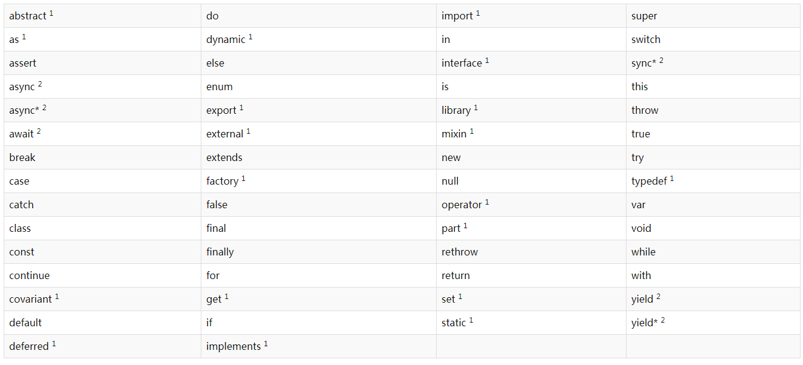

# A Tour of the Dart Language
## 一个基础的Dart程序
以下的代码使用了许多Dart最基础的特性：
``` Dart
// Define a function.
printInteger(int aNumber) {
  print('The number is $aNumber.'); // Print to console.
}

// This is where the app starts executing.
main() {
  var number = 42; // Declare and initialize a variable.
  printInteger(number); // Call a function.
}
```

以下是针对所有（或几乎所有）Dart apps都会使用到的东西：

<font color=#008f92>// This is a comment.</font><br/>
一个单行注释。Dart也支持多行注释和文档注释。

<font color=#008f92>int</font><br/>
表示类型。还有一些其他的内置类型，如String、List以及bool。

<font color=#008f92>42</font><br/>
数字文字。数字文字是一种编译时常数。

<font color=#008f92>print()</font><br/>
一个展示输出内容的便捷的方式。

<font color=#008f92>$variableName (or ${expression})</font><br/>
字符串插值：在字符串文本中包含变量或表达式的字符串等效项。

<font color=#008f92>main()</font><br/>
启动应用程序执行的特殊、必需的顶级函数。

<font color=#008f92>var</font><br/>
一种定义不指定类型的变量的方法。

## 重要的概念
在学习DART语言时，请记住以下事实和概念：

* 可以放在变量中的所有东西都是对象，每个对象都是类的实例。偶数、函数和NULL都是对象。所有对象都继承自Object类。
* 虽然Dart是强类型的，但类型注释是可选的，因为Dart可以推断类型。在上面的代码中，数字被推断为int类型。如果要显式声明不需要任何类型，请使用特殊类型Dynamic。
* Dart支持泛型类型，如List<int>(整数列表)或List<dynamic>(任何类型的对象列表)。
* Dart支持顶级函数(如main())以及绑定到类或对象的函数(分别为静态方法和实例方法)。您还可以在函数中创建函数(嵌套或本地函数)。
* 类似地，Dart支持顶级变量，以及绑定到类或对象(静态和实例变量)的变量。实例变量有时称为字段或属性。
* 与Java不同，Dart没有public、protected和private关键字。如果标识符以下划线(_)开头，则该标识符对其库是私有的。
* 标识符可以字母或下划线(_)开头，后跟这些字符加数字的任何组合。
* 需要清楚的界定好某条语句是一个表达式还是陈述式。
* Dart工具可以报告两种类型的问题：警告和错误。警告只是表明您的代码可能无法工作，但它们并不妨碍程序的执行。错误可以是编译时错误，也可以是运行时错误。编译时错误根本阻止代码执行；运行时错误会导致在代码执行时引发异常。

## 关键字
下表列出了DART语言专门处理的单词。<br/>
<br/>
上标1的单词是内置标识符。避免使用内置标识符作为标识符。如果您试图为类名或类型名使用内置标识符，则会发生编译时错误。

带有上标2的两个字是较新的、有限的保留字，它们与在DART 1.0版本之后添加的异步支持有关。您不能在任何用异步、异步*或同步*标记的函数体中使用async, await或 yield作为标识符。有关更多信息，请参见异步支持。

关键字表中的所有其他字都是保留字。不能使用保留字作为标识符。

## 变量
下面是创建变量并对其进行初始化的示例:
``` Dart
var name = 'Bob';
```

